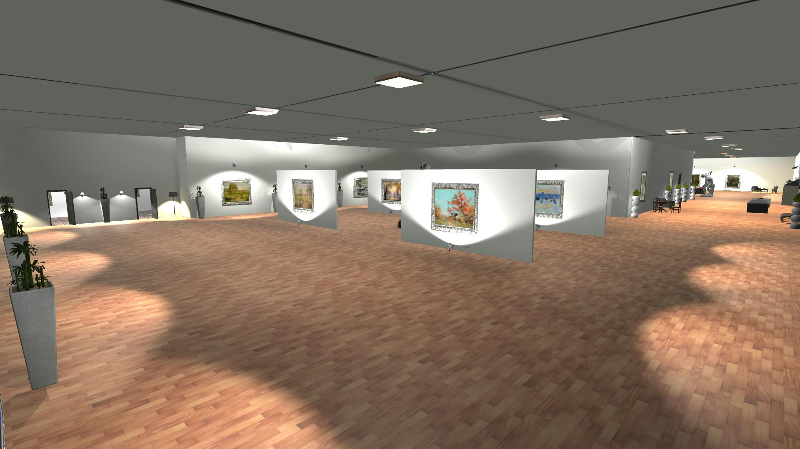

# Virtual Museum

This application was developed in the Unity game engine (version 2018), as a project for my Human Computer Interaction course, during my Computer Science & Engineering studies at the University of Ioannina.

The project involves porting a museum tour to virtual space for the purpose of entertainment, as well as to showcase a framework for studying visitor behaviour during their visit to a physical museum space. 

The framework presents a method for curators to use virtual tours to collect data on visitor behaviour. In our case, this is achieved by collecting data on the time users spend viewing each exhibit, movement time and speed, as well as camera movement metrics.

### Exhibitions
The museum consists of two main exhibits, namely the Van Gogh and Impressionism exhibits. These choices were made due to the high aesthetic value offered by these two themes, as well as the fact that they are not too "sharp" visually, allowing the design of a calming, pleasant space. Similarly, the same design principle was applied in the acoustic design. 

The virtual space features high resolution version of the displayed works, an audio background, as well as audioguides for the two main exhibitions. Unfortunately, advanced AI speech synthesis was not available back in 2018 when this project was authored.

The museum also features two bonus rooms, found at the back right corner of the Impressionism exxhibition, at the very end of the tour. The first one is comprised of a collection of Japanese prints collected by Vincent Van Gogh and his brother (Theo), found on the left door. To unlock this room, the user must find the secret button located on the piano next to the "The Potato Eaters" exhibit in the Van Gogh exhibition, as hinted in the tutorial message.
The second exhibition, located on the same wall as the other bonus room, is unlocked by solving a quiz which comes up in the UI when the user stands in front of the door's entrance. The user must answer at least 5 out of the 10 available questions correctly. The quiz features questions about Vincent Van Gogh's life and career, which can be answered by utilizing the information presented to the user through the audioguide of the respective exhibition. This room features exhibitions belonging to art movements that were influenced by the the art movements of the two main exhibits.

### Human Computer Interaction Metrics

Another feature of this project, which was mentioned already, is recording metrics around the user's behaviour. After exiting the application, one can find the following metrics in the file "Metrics.txt".

- Viewing time of each exhibit (the user was standing near and had a clear view of the exhibit)
- Camera movement: total movement time, average movement speed (in degrees)
- Time spend in each room (exhibit A, B, hallway)
- Total walking distance and average walking speed

### Installation
There are no dependencies needed to run the application, except from the necessary GPU drivers, as provided by your GPU vendor.
Unpack MuseumAlpha.rar, found [here](https://drive.google.com/drive/folders/1CUqxNglRo9HSoForRASVJbYqxA5p7acn?usp=sharing) and run "Museum Alpha.exe". 

### Controls

| Action  | Key binding |
| ------------- | ------------- |
| Move forward  | W |
| Move backward  | S  |
| Move left | A |
| Move right | D |
| Camera movement | Mouse |
| Interact | E|
| Quit application | F4 |

#### Free camera controls
| Action  | Key binding |
| ------------- | ------------- |
| Toggle free camera mode | C |
| Move up vertically  | Ctrl |
| Move down vertically  | Left Shift |
| Take screenshot | K |

Screenshots taken in free camera mode are stored in the "screenshots" folder, located in the application's main directory.

#### Quiz controls
The quiz utilizes the I, J, K, and L bindings to select a possible answer. This layout was chosen due to not being a familiar one to the user, contrary to the popular "WASD" layout commonly used in video games. The reasoning is that this way we avoid input errors due to sudden, habitual movements, while at the same time giving more time to the user to think (or remember) about the right answer, by slowing them down on purpose.

### Resources used
- Van Gogh Exhibition: Chopin Nocturnes Op. 9 No. 2 (A personal favourite)
- Impressionism Exhibition: Chopin Nocturnes Op. 9 No. 1
- Exhibit images were downloaded from Wikipedia Commons
- Audio guide text to speech synthesis tool: http://www.fromtexttospeech.com (Daisy)
- All Unity assets used were free assets attained from the Unity store
